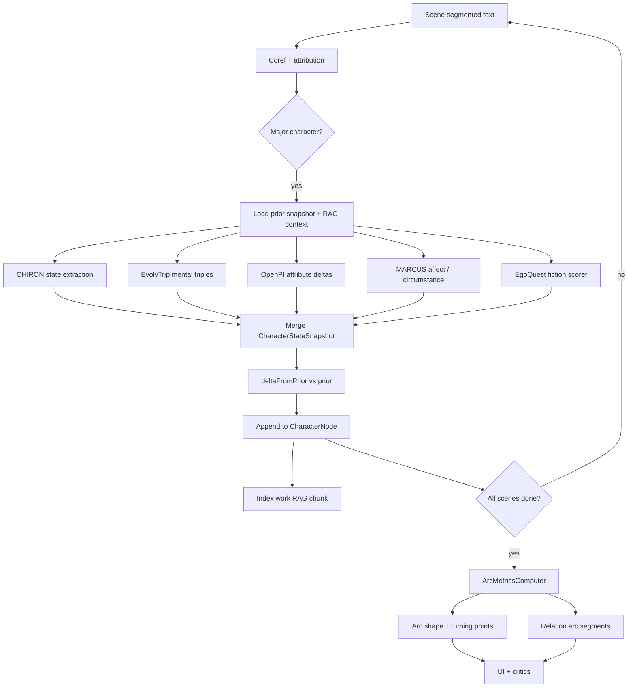

# Narrative AI — Architecture

> Neuro-symbolic narrative intelligence platform for mapping story structure, character depth, stylistic coherence, and plot integrity.

**Stack:** Next.js 15 (App Router) · TypeScript · Tailwind · shadcn/ui · Graphology · React Flow · Cytoscape.js  
**Character depth:** EgoQuest-adapted module (from [psyche-converse-1](https://github.com/Dinamush/psyche-converse))  
**Status:** Greenfield — this document is the source of truth for implementation.

---

## Table of Contents

1. [Vision & Principles](#1-vision--principles)
2. [System Overview](#2-system-overview)
3. [Monorepo Structure](#3-monorepo-structure)
4. [Data Model](#4-data-model)
5. [Analysis Pipeline](#5-analysis-pipeline)
6. [EgoQuest Fiction Integration](#6-egoquest-fiction-integration)
7. [Plot Integrity Engine](#7-plot-integrity-engine)
8. [Visualization Layer](#8-visualization-layer)
9. [UI/UX Design System](#9-uiux-design-system)
10. [API & Server Architecture](#10-api--server-architecture)
11. [Persistence & Auth](#11-persistence--auth)
12. [External Dependencies](#12-external-dependencies)
13. [Phased Roadmap](#13-phased-roadmap)
14. [Risks & Mitigations](#14-risks--mitigations)
15. [RAG Architecture](#15-rag-architecture)
16. [Character Arcs & State Timelines](#16-character-arcs--state-timelines)
17. [References](#17-references)

---

## 1. Vision & Principles

### What we build

An application that ingests written works and produces:

| Layer | Output |
|-------|--------|
| **Structural** | Fabula DAG (causal truth) + syuzhet graph (presentation order) |
| **Dramatic** | Rising action, climax, connective tissue, tension curve vs. target arc |
| **Stylistic** | Register (MDA dimensions), wavelength (tonal coherence), themes |
| **Character** | Per-character EgoQuest profiles, relationship networks, arc trajectories |
| **Diagnostic** | Plot holes, continuity errors, OOC behavior, unresolved threads |
| **Visual** | Native interactive diagrams: story editor, character network, tension timeline |

### Core design principles

1. **Graph-first, not text-first** — Structure is planned and validated on graphs before prose generation or display. LLMs extract and critique; they do not own causality.
2. **Dual-layer narrative model** — Fabula (chronological/causal) and syuzhet (presentation/discourse) are separate coupled graphs linked by a reference map.
3. **Evidence grounding** — Every extracted event, proposition, and psychodynamic signal links to a text span. No invented trauma or plot points.
4. **Symbolic before neural** — DAG validation, reachability, and state consistency run deterministically; LLM critics handle nuance.
5. **Confidence gating** — Low-evidence EgoQuest dimensions are hidden, not displayed as fact.
6. **Dual memory** — The narrative graph is authoritative for structure and causality; RAG retrieves relevant prose and methodology for LLM jobs. Never collapse time-indexed character mentions into a single static node.

---

## 2. System Overview

```
┌─────────────────────────────────────────────────────────────────────────┐
│                         Next.js App (apps/web)                          │
├──────────────────┬──────────────────────┬───────────────────────────────┤
│  Story Editor    │  Character Network   │  Dramatic Arc + Diagnostics   │
│  (React Flow)    │  (Cytoscape.js)      │  (Recharts / D3)              │
├──────────────────┴──────────────────────┴───────────────────────────────┤
│              Client Graph Store (Zustand + Zod validation)                │
├─────────────────────────────────────────────────────────────────────────┤
│                    Server Actions / API Routes                          │
│  FabulaBuilder · SyuzhetProjector · StyleAnalyzer · ConstraintEngine    │
│  Critics (plot / character / theme) · EgoQuestFictionService            │
│  NarrativeRagService (methodology + work-scoped retrieval)                │
├─────────────────────────────────────────────────────────────────────────┤
│  packages/graph-schema    packages/narrative-engine                     │
│  packages/egoquest-fiction  packages/visualization  rag/corpus            │
├─────────────────────────────────────────────────────────────────────────┤
│  Persistence: JSON documents (MVP) → Supabase PostgreSQL (production)   │
└─────────────────────────────────────────────────────────────────────────┘
```

### Data flow

```
Upload / Paste
    → Segmentation (chapters, scenes)
    → Coreference + character ID
    → Event extraction → Fabula DAG
    → Syuzhet projection + reference map
    → Style analysis (register, theme, wavelength, tension)
    → Per-scene character state extraction (beliefs, goals, emotions, physical)
    → Per-scene EgoQuest scoring (per attributed character)
    → State timelines + arc metrics (MARCUS-style + EgoQuest trajectories)
    → RAG index (source chunks + state snapshots + events)
    → Constraint validation + RAG-augmented LLM critics
    → NarrativeGraph + AnalysisResult → UI views
```

### Theoretical foundations

| Framework | Role |
|-----------|------|
| Fabula / Syuzhet (Russian Formalism) | Dual graph layers |
| Chatman (kernels vs satellites) | Prunable plot spine |
| Narrative Maps (st-graph) | Multi-storyline weighted DAG |
| PLOTTER | Event + character typed graphs, critics |
| FlawedFictions | Plot-hole taxonomy + benchmark pattern |
| Moretti character networks | SNA on fiction |
| Biber MDA | Register dimensions |
| MARCUS | Event-centric circumstance arcs (actor vs experiencer) |
| EvolvTrip / CHIRON | Mental-state triples and validated character sheets |
| E²RAG / NKW | Temporal entity–event bipartite graphs; narrative asset bundles |
| EgoQuest (PsycheConverse) | Psychodynamic character depth |

---

## 3. Monorepo Structure

```
narrative-ai/
├── apps/
│   └── web/                          # Next.js 15 App Router
│       ├── app/
│       │   ├── (marketing)/          # Landing, methodology
│       │   ├── (app)/                # Authenticated workspace
│       │   │   ├── projects/
│       │   │   │   └── [id]/
│       │   │   │       ├── page.tsx          # Project overview
│       │   │   │       ├── structure/        # React Flow editor
│       │   │   │       ├── characters/       # Network + EGO profiles
│       │   │   │       ├── arc/              # Tension timeline
│       │   │   │       └── diagnostics/      # Plot issues panel
│       │   │   └── layout.tsx
│       │   └── api/
│       │       ├── analyze/route.ts
│       │       ├── extract/route.ts
│       │       └── projects/route.ts
│       ├── components/
│       │   ├── layout/               # AppShell, Sidebar, CommandPalette
│       │   ├── story-editor/         # React Flow nodes, edges, panels
│       │   ├── character-network/    # Cytoscape wrapper
│       │   ├── dramatic-arc/         # Tension charts
│       │   ├── diagnostics/          # Issue cards, severity badges
│       │   ├── ego-profile/          # Adapted EGOProfileDisplay
│       │   └── ui/                   # shadcn primitives
│       ├── hooks/
│       ├── stores/
│       │   └── narrative-graph-store.ts
│       └── lib/
│
├── packages/
│   ├── graph-schema/                 # Zod schemas, types, validators
│   │   ├── src/
│   │   │   ├── narrative-graph.ts
│   │   │   ├── fabula.ts
│   │   │   ├── syuzhet.ts
│   │   │   ├── character.ts
│   │   │   ├── analysis-result.ts
│   │   │   └── index.ts
│   │   └── package.json
│   │
│   ├── narrative-engine/             # Analysis orchestration
│   │   ├── src/
│   │   │   ├── ingestion/
│   │   │   ├── extraction/
│   │   │   ├── fabula-builder.ts
│   │   │   ├── syuzhet-projector.ts
│   │   │   ├── style-analyzer.ts
│   │   │   ├── constraint-engine.ts
│   │   │   └── critics/
│   │   └── package.json
│   │
│   ├── egoquest-fiction/             # Adapted from psyche-converse-1
│   │   ├── src/
│   │   │   ├── attribution-service.ts
│   │   │   ├── fiction-scorer.ts
│   │   │   ├── arc-aggregator.ts
│   │   │   └── types.ts
│   │   └── package.json
│   │
│   └── visualization/                # Shared graph layout utilities
│       ├── src/
│       │   ├── layouts/
│       │   └── theme.ts
│       └── package.json
│
├── rag/
│   ├── corpus/                       # Static methodology knowledge (see §15)
│   │   ├── 01_fiction_attribution_rules.md
│   │   ├── 02_fabula_syuzhet_principles.md
│   │   └── ...
│   └── store/
│       └── index.json                # Embedded chunk index (dev fallback)
│
├── backend/                          # Optional local API (adapt from psyche-converse-1)
│   ├── local-api.mjs
│   └── rag/
│       └── RagStore.mjs
│
├── docs/
│   └── ADRs/                         # Architecture decision records
├── ARCHITECTURE.md                   # This file
├── package.json                      # Turborepo / pnpm workspaces
└── turbo.json
```

### Package dependency graph

```
apps/web
  → packages/graph-schema
  → packages/narrative-engine
  → packages/egoquest-fiction
  → packages/visualization

packages/narrative-engine
  → packages/graph-schema
  → packages/egoquest-fiction

packages/egoquest-fiction
  → (optional git submodule: psyche-converse-1 analysis modules)
```

---

## 4. Data Model

All schemas are defined in `packages/graph-schema` with **Zod** and exported as TypeScript types. The graph store validates on every mutation.

### 4.1 Top-level document

```typescript
type NarrativeWork = {
  id: string
  title: string
  rawText: string
  metadata: {
    genre?: string
    pov?: "first" | "third_limited" | "third_omniscient" | "multi"
    structureModel?: DramaticModel
    wordCount: number
  }
  graph: NarrativeGraph
  analysis: AnalysisResult
  schemaVersion: "1.1.0"
  createdAt: string
  updatedAt: string
}

type DramaticModel =
  | "freytag"
  | "three_act"
  | "heros_journey"
  | "save_the_cat"
  | "fichtean"
```

### 4.2 NarrativeGraph (four coupled subgraphs)

```typescript
type NarrativeGraph = {
  fabula: { nodes: EventNode[]; edges: EventEdge[] }
  syuzhet: { nodes: SceneNode[]; edges: SyuzhetEdge[] }
  characters: { nodes: CharacterNode[]; edges: CharacterEdge[] }
  timeline: NarrativeTimeline
  referenceMap: ReferenceLink[]
  propositions: Proposition[]
  styleTimeline: SceneStyleVector[]
  episodes: Episode[]
}
```

### 4.3 Fabula layer (ground truth)

```typescript
type EventNode = {
  id: string
  label: string
  fabulaTime: number
  participants: string[]
  locationId?: string
  stateDelta?: Record<string, unknown>
  eventType: "action" | "happening" | "stasis"
  kernelLevel: "kernel" | "satellite"
  narrativeStage?:
    | "exposition"
    | "rising_action"
    | "pre_climax"
    | "climax"
    | "falling_action"
    | "resolution"
  tensionTarget?: number
  proppFunction?: string
  evidenceSpan: { start: number; end: number }
}

type EventEdge = {
  id: string
  source: string
  target: string
  relation:
    | "causal"
    | "temporal"
    | "foreshadowing"
    | "suspense"
    | "enables"
    | "requires"
  weight?: number
}
```

### 4.4 Syuzhet layer (presentation)

```typescript
type SceneNode = {
  id: string
  syuzhetIndex: number
  eventIds: string[]
  discourseOps?: ("flashback" | "flashforward" | "ellipsis" | "pause")[]
  pov?: string
  textSpanRef: { start: number; end: number }
  measuredTension?: number
  registerVector?: number[]
  themeTags?: string[]
}

type SyuzhetEdge = {
  id: string
  source: string
  target: string
  type: "next" | "parallel" | "branch"
}

type ReferenceLink = {
  sceneId: string
  eventId: string
  textOffset?: [number, number]
}
```

### 4.5 Character layer

Characters have **stable identity** (`CharacterNode`) separate from **time-indexed state** (`CharacterStateSnapshot` per scene/chapter). Collapsing all mentions of "Hermione" into one static node erases arc from "rule-obsessed" to "rule-breaker" — a known failure mode in flat KG-RAG ([E²RAG](https://aclanthology.org/2026.eacl-long.90.pdf)).

```typescript
type CharacterNode = {
  id: string
  name: string
  aliases: string[]
  role?: "protagonist" | "antagonist" | "deuteragonist" | "supporting" | "minor"
  firstAppearance: NarrativePosition
  egoProfiles: Array<{
    sceneId: string
    profile: EGOProfile
    confidence: number
    evidenceSpans: Array<{ start: number; end: number }>
  }>
  stateSnapshots: CharacterStateSnapshot[]
  arcMetrics: CharacterArcMetrics
  arcTrajectory?: {
    differentiation: number[]
    shadowIntensity: number[]
    driverStability: number[]
    circumstanceActor: number[]
    circumstanceExperiencer: number[]
    sceneIds: string[]
  }
}

type CharacterEdge = {
  id: string
  source: string
  target: string
  relation: "conflict" | "cooperative" | "emotional" | "hidden"
  scenes: string[]
  weight: number
  sentiment?: number
  supportingEventIds: string[]
  relationArc?: RelationArcSegment[]
}
```

### 4.6 Narrative timeline & character state

```typescript
type NarrativePosition = {
  chapterId?: string
  chapterIndex: number
  sceneId: string
  syuzhetIndex: number
  fabulaTime: number
  narrativeProgress: number  // 0.0–1.0 normalized position in work
}

type NarrativeTimeline = {
  chapters: Chapter[]
  segments: SceneSegment[]   // ordered by narrative_time
  provenance: Map<string, ChunkRef>
}

type Chapter = {
  id: string
  index: number
  title?: string
  sceneIds: string[]
  textSpanRef: { start: number; end: number }
}

type SceneSegment = {
  sceneId: string
  position: NarrativePosition
  participantIds: string[]
  summary?: string
}

type ChunkRef = {
  chunkId: string
  chunkType: RagChunkType
  textSpanRef: { start: number; end: number }
  sceneId?: string
  characterId?: string
  eventId?: string
}

type RagChunkType =
  | "source_passage"
  | "scene_analysis"
  | "character_state_snapshot"
  | "event_record"
  | "atomic_fact"
  | "relation_arc_segment"
  | "episode_summary"
```

#### CharacterStateSnapshot (per character, per scene)

Synthesizes CHIRON character-sheet fields, EvolvTrip mental-state triples, OpenPI-style attribute deltas, and EgoQuest psychodynamic signals into one auditable record.

```typescript
type CharacterStateSnapshot = {
  id: string
  characterId: string
  position: NarrativePosition
  confidence: number

  // CHIRON-style validated statements (each requires evidenceSpan)
  dialogue: StateStatement[]
  physical: StateStatement[]
  knowledge: StateStatement[]
  goals: StateStatement[]

  // EvolvTrip-style mental states
  mentalStates: MentalStateTriple[]

  // OpenPI-style embodied / world-state deltas
  attributeDeltas: AttributeDelta[]

  // MARCUS-style affect (actor vs experiencer roles in scene events)
  affect: {
    valence: number
    arousal: number
    dominance?: number
    circumstanceAsActor: number
    circumstanceAsExperiencer: number
    emotions: Array<{ label: string; confidence: number }>
  }

  // EgoQuest psychodynamic layer (gated by activationStrength)
  egoQuest?: {
    profile: EGOProfile
    activationStrength: number
    dominantMechanisms: string[]
  }

  // Delta vs prior snapshot (for arc detection)
  deltaFromPrior?: {
    priorSnapshotId: string
    beliefRevisions: string[]
    goalChanges: string[]
    relationshipShifts: string[]
    egoQuestShifts: string[]
  }

  evidenceSpans: Array<{ start: number; end: number }>
}

type StateStatement = {
  id: string
  category: "dialogue" | "physical" | "knowledge" | "goals"
  text: string
  polarity: "affirmed" | "negated" | "uncertain"
  evidenceSpan: { start: number; end: number }
  entailmentScore?: number
}

type MentalStateTriple = {
  id: string
  subject: string
  predicate: "believes_about" | "desires_for" | "feels_towards" | "intends_to"
  object: string
  objectType: "character" | "event" | "proposition" | "entity"
  perspective: string
  supersedes?: string
  evidenceSpan: { start: number; end: number }
}

type AttributeDelta = {
  attribute: string
  valueBefore?: string | number | boolean
  valueAfter: string | number | boolean
  evidenceSpan: { start: number; end: number }
}
```

#### Character arc metrics

```typescript
type CharacterArcMetrics = {
  characterId: string
  arcShape?: "rise" | "fall" | "u_shape" | "oscillating" | "flat"
  turningPointSceneIds: string[]
  uedDisplacementPeak?: number
  uedDisplacementLength?: number
  actionDivergenceByChapter?: number[]
  relationalArcShape?: Record<string, "rise" | "fall" | "u_shape" | "oscillating">
  egoQuestArc?: {
    differentiationStart: number
    differentiationEnd: number
    shadowPeakSceneId?: string
    driverStabilityMean: number
  }
  computedAt: string
}

type RelationArcSegment = {
  fromPosition: NarrativePosition
  toPosition: NarrativePosition
  circumstanceScore: number
  relationLabel?: string
  eventIds: string[]
}
```

### 4.7 Episodes & storylines

Macro-structure layer for multi-scene arcs and RAG episode summaries ([NKW](https://arxiv.org/html/2606.05724)).

```typescript
type Episode = {
  id: string
  label: string
  sceneIds: string[]
  participantIds: string[]
  motif?: string
  conflict?: string
  outcome?: string
  storylineId?: string
}

type Storyline = {
  id: string
  label: string
  episodeIds: string[]
  sourceEventId?: string
  sinkEventId?: string
}
```

### 4.8 Stylistic vectors

```typescript
type SceneStyleVector = {
  sceneId: string
  registerMDA: {
    narrativity: number
    orality: number
    informational: number
    argumentation: number
  }
  sentiment: { valence: number; arousal: number }
  lexicalFingerprint: number[]
  themeTags: string[]
  wavelengthDriftFromPrev?: number
}
```

### 4.9 Analysis output

```typescript
type PlotIssue = {
  id: string
  type:
    | "continuity"
    | "causal_break"
    | "ooc_behavior"
    | "unresolved_thread"
    | "impossible_event"
    | "theme_drift"
    | "wavelength_spike"
    | "tension_mismatch"
  severity: "critical" | "major" | "minor" | "suggestion"
  affectedNodeIds: string[]
  textSpans: Array<{ start: number; end: number }>
  message: string
  suggestedFix?: string
}

type AnalysisResult = {
  dramaticArc: {
    model: DramaticModel
    tensionSeries: Array<{ sceneId: string; target: number; measured: number }>
    climaxSceneId?: string
    turningPoints: string[]
  }
  themes: Array<{ label: string; scenes: string[]; confidence: number }>
  wavelengthDrift: Array<{
    from: string
    to: string
    distance: number
    flagged: boolean
  }>
  plotIssues: PlotIssue[]
  characterInsights: Array<{
    characterId: string
    summary: string
    arcType?: string
    arcShape?: CharacterArcMetrics["arcShape"]
    keyTensions: string[]
    majorTurningPoints: string[]
    stateDeltaHighlights: string[]
  }>
  computedAt: string
}
```

### 4.10 Propositions (continuity checking)

```typescript
type Proposition = {
  id: string
  sceneId: string
  fabulaTime: number
  subject: string
  predicate: string
  polarity: "affirmed" | "negated"
  evidenceSpan: { start: number; end: number }
}
```

---

## 5. Analysis Pipeline

Pipeline runs as a **sequential DAG of jobs** with progress streaming to the client via Server-Sent Events or polling.

### Phase 0 — Ingestion

| Step | Implementation |
|------|----------------|
| Format parsing | `.txt`, `.md`, `.docx`, Fountain screenplay |
| Segmentation | Chapter headers, `***`, `---` / `--` scene breaks, time-jump openers, stage directions, oversized-scene rebalance (~900 words) |
| Word count + metadata | Auto-detect POV hints from pronoun ratios |

#### 5.0.1 Literary scene segmentation (theory)

Segmentation follows **narratological scene** boundaries rather than arbitrary token windows.

| Signal | Theory | Implementation |
|--------|--------|----------------|
| **Strong break** | *Syuzhet* discontinuity (Genette, *Narrative Discourse*) — reader perceives a new presentational unit | `***`, `---`, `###` on their own line |
| **Weak break** | Beat / ellipsis within chapter fiction (Bal, *Narratology*) | `--` on its own line → `discourseOps: ["ellipsis"]` on child scene |
| **Time jump** | Fabula-time shift without explicit marker (Chatman, *Story and Discourse*) | Openers: *Some time later*, *Days passed*, *That evening*, *Blackness hung* |
| **Stage direction** | Dramatic interlude / chorus (screenplay convention) | `CHORUS:`, `SCENE N:`, `(fade`, `INT.` / `EXT.` |
| **Oversized scene** | LLM context + event-density limits | Split at weak breaks or paragraph boundaries when \> 900 words |

**Rationale:** A single 3,000-word chapter with internal `--` beats is one *chapter* but multiple *scenes* for fabula extraction. Missing weak breaks caused under-segmentation (e.g. Red Ants: 4 scenes → 10).

### Phase 1 — Fabula construction

1. **Event extraction** — LLM with structured JSON schema per scene; **dynamic event cap** `min(24, max(6, 6 + ⌈words/100⌉))`; prompt window scales `4k–12k` chars; Creole-aware participant hints
2. **Causal linking** — Pairwise or chain prompting; typed edges
3. **DAG enforcement** — Tarjan cycle detection; cycles → discourse annotation or issue flag
4. **Kernel/satellite** — Chatman classification: removable without breaking plot?

#### 5.1.1 Fabula participant fusion (character ID)

Character identity combines **surface mentions** (regex + role descriptors) with **fabula participants** (LLM-extracted agents/patients):

```
Scene text ──► name-extractor (Capitalized tokens + role phrases)
                    │
Fabula events ──► participant-resolver (normalize "old woman" → Old woman)
                    │
                    └──► merge counts (fabula weight ×2) ──► isLikelyCharacterName
```

| Problem | Fix |
|---------|-----|
| Creole sentence-initial tokens (`Yuh`, `But`, `Kill`) | `NAME_STOP_WORDS` + verb filter |
| Role-only references (`the old woman`, `his cousin`) | `ROLE_DESCRIPTOR` regex → canonical labels |
| Fabula says "Uncle" but text says "larger man" | `participant-resolver` pattern table |
| Rank-based protagonist = most mentions | Explicit role rules: Ant → protagonist, Uncle → antagonist |
| EgoQuest empty attributed text | Word-boundary scene presence + dialogue attributor pronoun tags |

Dialect benchmark: *Red Ants (Creole)* — target cast Ant, Uncle, Margaret, Old woman, Cousin, John, Police; exclude function-word false positives.

### Phase 2 — Syuzhet projection

1. Default syuzhet = topological sort of fabula
2. Annotate `discourseOps` where presentation order ≠ chronological order
3. Build `referenceMap` linking scenes → events → text offsets

### Phase 3 — Stylistic analysis

| Signal | Method |
|--------|--------|
| **Register** | MDA-lite: pronoun ratios, TTR/MATTR, clause complexity, tense distribution |
| **Theme** | Abstractive scene retelling → topic tags; cluster across work |
| **Wavelength** | Embedding centroid per scene; cosine drift between adjacent scenes |
| **Tension** | Sentiment valence/arousal per scene vs. `tensionTarget` for chosen dramatic model |

### Phase 4 — Character analysis & state timelines

See [Section 6](#6-egoquest-fiction-integration) and [Section 16](#16-character-arcs--state-timelines).

| Step | Implementation |
|------|----------------|
| Identity | Heuristic name extraction + fabula participant fusion + dialogue attribution (BookNLP / LLM coref planned) → `CharacterNode` + alias registry |
| Attribution | Dialogue, internal monologue, FID spans per character per scene |
| Mental state | EvolvTrip triples + CHIRON statements per major character per scene |
| Physical/knowledge | OpenPI-style `(entity, attr, before, after)` deltas |
| Affect | MARCUS circumstance (actor + experiencer) + UED dialogue windows |
| EgoQuest | Per-scene psychodynamic scoring with confidence gating |
| Arc aggregation | EMA / Savitzky–Golay smoothing; change-point detection |
| Relation arcs | Per-pair circumstance curves across scenes |
| RAG index | Embed state snapshots + source passages (see §15) |

### Phase 5 — Validation & critics

See [Section 7](#7-plot-integrity-engine).

### Job orchestration

```typescript
type AnalysisJob = {
  workId: string
  status: "queued" | "running" | "completed" | "failed"
  currentPhase: AnalysisPhase
  progress: number
  errors: string[]
}

type AnalysisPhase =
  | "ingestion"
  | "fabula"
  | "syuzhet"
  | "style"
  | "character_states"
  | "egoquest"
  | "arc_aggregation"
  | "rag_indexing"
  | "validation"
  | "critics"
```

---

## 6. EgoQuest Fiction Integration

EgoQuest (PsycheConverse) was built for **live conversational personality typing**. Fiction requires a dedicated adaptation layer in `packages/egoquest-fiction`.

### Source modules (psyche-converse-1)

| Module | Path | Reuse |
|--------|------|-------|
| EgoQuestTextScorer | `src/services/personality/analysis/EgoQuestTextScorer.ts` | Keyword + LLM scoring |
| egoQuest-markers | `src/services/personality/analysis/data/egoQuest-markers.ts` | Lexicons |
| EGOCalculator | `src/services/personality/analysis/EGOCalculator.ts` | EGOProfile synthesis |
| EgoMetricCalculator | `src/services/personality/analysis/EgoMetricCalculator.ts` | SHADOW/CONTINUUM/DRIVER |
| ego.ts types | `src/types/personality/ego.ts` | Schema v1.2.0 |

### Fiction adaptation rules

| Rule | Rationale |
|------|-----------|
| Score **per character, per scene** | Arcs are temporal |
| Only **attributed text** (dialogue, internal monologue, free indirect discourse) | Exclude omniscient narrator |
| Require `activationStrength ≥ 0.12` + `≥ 80 chars` + evidence spans | Anti-hallucination (same as live scoring) |
| Gate low-confidence dimensions in UI | Don't invent wounds/masks |
| Separate **mask** (performance) from **shadow** (stress) from **driver** (motivation) | Literary characters perform roles |
| Lower typology ensemble weight vs. psychodynamic layers | MBTI from fiction dialogue is noisy |

### Fiction pipeline

```
Scene text
  → AttributionService (coreference / LLM attribution)
  → Per-character attributed spans
  → Parallel per major character:
      ├── CharacterStateExtractor → CharacterStateSnapshot
      │     (CHIRON statements + EvolvTrip triples + attribute deltas)
      ├── AffectScorer → circumstance actor/experiencer + VAD
      └── EgoQuestTextScorer → optional LLM refinement (55/45 blend)
  → EGOCalculator → EGOProfile snapshot (merged into state snapshot)
  → ArcAggregator (EMA or Savitzky-Golay across scenes)
  → ArcMetricsComputer (shape, turning points, relational arcs)
  → CharacterNode.stateSnapshots + arcTrajectory + arcMetrics
  → RAG index update (state snapshot chunks)
```

### Arc metrics tracked

**EgoQuest psychodynamic:**
- `differentiation.level` — Bowen growth arc (fused → high)
- `shadow.intensity` — crisis spikes at plot beats
- `driver` stability vs. Enneagram stress-path shifts
- `internalTensions[]` activation over time

**MARCUS / UED quantitative:**
- `circumstanceAsActor` / `circumstanceAsExperiencer` — fortune shift via sentiment + emotion
- `uedDisplacementPeak` / `uedDisplacementLength` — emotional distance from character home base
- `actionDivergenceByChapter` — portrayal-style behavioral change across chapters

**Relational:**
- Per-pair `RelationArcSegment[]` — circumstance curves for directed character pairs
- Latent relation labels (conflict, alliance, kinship) with trajectory shape clustering

### EGO meta-dimensions (reference)

| Dimension | Narrative use |
|-----------|---------------|
| **SHADOW** | Stress behavior at crisis beats; regression under pressure |
| **CONTINUUM** | Cognitive style spectrum within function pairs |
| **DRIVER** | Core motivation shaping actions |
| **Core wound** | Backstory-driven behavior patterns (evidence-required) |
| **Social mask** | Public persona vs. authentic self |
| **Differentiation** | Relational maturity arc across story |

### Calibration

- PDB fictional personas from psyche-converse-1 as regression anchors (not ground truth)
- Manual gold-standard short story with hand-labeled profiles for CI

---

## 7. Plot Integrity Engine

### Deterministic checks (fast)

| Check | Code | Issue type |
|-------|------|--------------|
| Fabula is DAG | `graphology` `alg.isDirectedAcyclic` | `causal_break` |
| Reachability start → end | BFS from inciting to resolution | `unresolved_thread` |
| State consistency | No contradictory propositions at same `fabulaTime` | `continuity` |
| Foreshadowing order | `fabulaTime(source) < fabulaTime(target)` | `causal_break` |
| Character edge support | Every major edge has `supportingEventIds` | `causal_break` |
| Tension fit | RMSE of measured vs. target curve | `tension_mismatch` |
| Wavelength drift | Adjacent-scene distance > threshold within act | `wavelength_spike` |

### LLM critics (slow, nuanced)

| Critic | Input | Output |
|--------|-------|--------|
| **Plot critic** | Fabula subgraph + scene summaries + RAG prior-scene facts | Causal gaps, unmotivated turns, pacing |
| **Character critic** | State snapshot timeline + EGOProfile + RAG attributed dialogue | OOC behavior, unmotivated belief/goal shifts |
| **Theme critic** | Theme tags + scene retellings + RAG thematically similar scenes | Drift, telling-not-showing |

Critics return `PlotIssue[]` with severity, spans, and optional `suggestedFix`. They **edit the graph**, not regenerate prose.

### Plot-hole taxonomy (FlawedFictions-aligned)

| Type | Detection |
|------|-----------|
| Continuity errors | Proposition contradiction: `F \ {φ} ⊢ ¬φ` |
| Out-of-character | Action vs. `CharacterStateSnapshot` goals/beliefs + EGOProfile + prior snapshots |
| Impossible events | World-rule violation in `stateDelta` |
| Unresolved storylines | Sink nodes with no path to resolution |
| Factual errors | Optional external KB check |

---

## 8. Visualization Layer

### Three primary views, one graph store

| View | Library | Purpose |
|------|---------|---------|
| **Story Editor** | React Flow + dagre/elkjs | Scene/beat nodes, causal/foreshadowing edges, drag-reorder syuzhet |
| **Character Network** | Cytoscape.js | Force-directed relationships, act slider, centrality highlight |
| **Dramatic Arc** | Recharts | Tension curve overlay, act boundaries, climax marker |
| **Character Depth** | Custom radar + time-series | EGO profile per scene, shadow/differentiation arcs, state snapshot diff |
| **State Timeline** | Recharts multi-line + table | Beliefs/goals/emotions across chapters; click → source passage |
| **Diagnostics** | shadcn cards + badges | Plot issues with jump-to-span |

### Story Editor node types

```typescript
type StoryEditorNodeType =
  | "scene"           // Syuzhet scene with prose preview
  | "event"           // Fabula event (kernel/satellite styling)
  | "act"             // Macro boundary (three-act, etc.)
  | "theme"           // Theme cluster anchor
  | "issue"           // Plot-hole badge node
```

### Story Editor edge types

```typescript
type StoryEditorEdgeType =
  | "causal"
  | "foreshadowing"
  | "suspense"
  | "flashback"
  | "parallel"
  | "character_relation"
```

### UI interaction patterns

- **Dual-lane view** — Fabula timeline (bottom) ↔ syuzhet order (top), linked by reference edges
- **Kernel/satellite toggle** — Dim embellishment nodes; highlight causal spine
- **Plot-hole badges** — Red indicators on nodes failing K_C or K_N
- **Tension heatmap** — Node border color from `tensionTarget - measuredTension` delta
- **Act slider** — Filter character network and arc charts by act
- **Click scene** → prose panel + EgoQuest profile for focal character

### Graph algorithms (Graphology)

- `isDirectedAcyclic` — plot integrity
- `bfsFromNode` — reachability
- `betweennessCentrality` — character importance
- `louvain` — faction/subplot communities

---

## 9. UI/UX Design System

Design decisions follow **ui-ux-pro-max** workflow principles for a **creative SaaS analytics product** aimed at writers, editors, and narrative researchers.

### 9.1 Product positioning

| Attribute | Value |
|-----------|-------|
| **Product type** | Creative SaaS — narrative analytics workspace |
| **Industry** | Publishing, screenwriting, literary education |
| **Tone** | Editorial, sophisticated, literary warmth |
| **Primary mode** | Dark (reduces eye strain for long reading sessions) |
| **Secondary mode** | Light (print-friendly exports, accessibility) |

### 9.2 Aesthetic direction: *Scriptorium*

A refined **editorial dark** aesthetic — the feeling of a private writer's study with manuscript maps pinned to a board. Not generic purple-gradient SaaS. Not brutalist. **Warm ink on deep parchment-black.**

**Differentiation hook:** Dual-lane fabula/syuzhet canvas with amber causal threads and cool-blue syuzhet flow — instantly recognizable as a narrative tool, not a generic node editor.

### 9.3 Color palette

```css
:root {
  /* Backgrounds */
  --bg-base:        #0C0B0A;   /* warm black — manuscript desk */
  --bg-surface:     #161412;   /* raised panels */
  --bg-elevated:    #1E1B18;   /* cards, popovers */
  --bg-overlay:     #262220;   /* hover states */

  /* Text */
  --text-primary:   #F5F0E8;   /* warm white — high contrast */
  --text-secondary: #A89F94;   /* muted body (slate-warm, not gray-400) */
  --text-tertiary:  #6B635A;   /* captions, metadata */

  /* Accent — causal / fabula layer */
  --accent-amber:   #D4A054;   /* rising action, causal edges */
  --accent-amber-dim: #8B6914;

  /* Accent — syuzhet / presentation layer */
  --accent-teal:    #5BA4A4;   /* scene flow, syuzhet edges */
  --accent-teal-dim: #2D6B6B;

  /* Semantic */
  --semantic-climax:  #C45C4A; /* climax beat, critical issues */
  --semantic-success: #6B9E6B; /* resolved threads, valid graph */
  --semantic-warning: #C4A84A; /* minor issues, wavelength drift */
  --semantic-critical:#A63D3D; /* plot holes, DAG cycles */

  /* Character / EgoQuest */
  --ego-shadow:     #7B5EA7;
  --ego-continuum:  #5B8DEF;
  --ego-driver:     #D47B5A;

  /* Borders */
  --border-subtle:  #2A2622;
  --border-default: #3D3830;
  --border-strong:  #524C44;
}
```

**Light mode overrides:**

```css
[data-theme="light"] {
  --bg-base:        #FAF8F5;
  --bg-surface:     #FFFFFF;
  --bg-elevated:    #FFFFFF;
  --text-primary:   #0F172A;   /* slate-900 — never gray-400 for body */
  --text-secondary: #475569;   /* slate-600 minimum for muted */
  --border-default: #E2E8F0;   /* visible borders — not white/10 */
}
```

### 9.4 Typography

| Role | Font | Weight | Use |
|------|------|--------|-----|
| **Display** | [Fraunces](https://fonts.google.com/specimen/Fraunces) | 500–700 | Page titles, act headers, climax labels |
| **Body** | [Source Serif 4](https://fonts.google.com/specimen/Source+Serif+4) | 400–600 | Prose panels, descriptions, issue text |
| **UI / Data** | [IBM Plex Sans](https://fonts.google.com/specimen/IBM+Plex+Sans) | 400–500 | Navigation, labels, metrics, buttons |
| **Mono** | [IBM Plex Mono](https://fonts.google.com/specimen/IBM+Plex+Mono) | 400 | Schema versions, node IDs, debug |

```html
<!-- Google Fonts import -->
<link href="https://fonts.googleapis.com/css2?family=Fraunces:opsz,wght@9..144,500;9..144,700&family=IBM+Plex+Mono&family=IBM+Plex+Sans:wght@400;500;600&family=Source+Serif+4:wght@400;600&display=swap" rel="stylesheet">
```

### 9.5 Chart & visualization colors

| Chart | Type | Library | Notes |
|-------|------|---------|-------|
| Tension curve | Line + area (target vs measured) | Recharts | Amber target dashed; teal measured solid |
| Register radar | Radar | Recharts | 4 MDA dimensions per scene |
| EGO arc | Multi-line time-series | Recharts | Shadow purple, differentiation blue, driver coral |
| Character centrality | Node size + color | Cytoscape | Size = degree; color = role |
| Theme distribution | Horizontal bar | Recharts | Top 8 themes by scene coverage |
| Wavelength drift | Heat strip along scene timeline | Custom D3 | Green → amber → red by drift magnitude |

### 9.6 Layout architecture

```
┌─────────────────────────────────────────────────────────────────┐
│  TopBar (floating, top-4 inset) — project title, analyze, export│
├──────────┬──────────────────────────────────────────────────────┤
│ Sidebar  │  Main Canvas (view-dependent)                        │
│ (240px)  │                                                      │
│          │  ┌─ Story Editor ─────────────────────────────────┐  │
│ Projects │  │  [Fabula lane]  amber causal graph             │  │
│ Views:   │  │  [Syuzhet lane] teal scene sequence            │  │
│ · Struct │  └────────────────────────────────────────────────┘  │
│ · Chars  │                                                      │
│ · Arc    │  ┌─ Inspector Panel (right, 360px, collapsible) ──┐  │
│ · Issues │  │  Scene prose / EGO profile / issue detail      │  │
│          │  └────────────────────────────────────────────────┘  │
├──────────┴──────────────────────────────────────────────────────┤
│  StatusBar — analysis progress, graph validity, issue count       │
└─────────────────────────────────────────────────────────────────┘
```

**Spacing rules (ui-ux-pro-max):**
- Floating navbar: `top-4 left-4 right-4`, not flush to viewport edges
- Content padding accounts for fixed chrome height
- Consistent `max-w-[1600px]` for non-canvas panels
- Canvas is full-bleed within main area

### 9.7 Component standards

| Rule | Implementation |
|------|----------------|
| Icons | **Lucide React** only — no emoji icons |
| Icon size | `w-5 h-5` (20px) in nav; `w-4 h-4` inline |
| Clickable elements | `cursor-pointer` on all interactive surfaces |
| Hover | `transition-colors duration-200` — no `scale` transforms that shift layout |
| Focus | Visible `ring-2 ring-accent-amber ring-offset-2 ring-offset-bg-base` |
| Cards | `bg-bg-elevated border border-border-default rounded-lg` |
| Glass (dark) | `bg-bg-surface/90 backdrop-blur-sm` — sufficient opacity |
| Glass (light) | `bg-white/80` minimum — never `bg-white/10` |
| Loading | Skeleton shimmer on graph nodes; progress bar for analysis phases |
| Motion | `prefers-reduced-motion: reduce` disables canvas animations |

### 9.8 Key screens

#### Landing (`(marketing)`)

| Section | Content |
|---------|---------|
| Hero | "Map the invisible structure of your story" + upload CTA |
| Social proof | Writer/editor testimonials (when available) |
| Feature grid | Structure · Characters · Arc · Diagnostics |
| Methodology | Link to fabula/syuzhet/EgoQuest explainer |
| CTA | Start analysis — free tier |

#### Project workspace (`(app)/projects/[id]`)

| Tab | Primary view |
|-----|--------------|
| **Structure** | React Flow dual-lane editor |
| **Characters** | Cytoscape network + EGO profile drawer |
| **Arc** | Tension timeline + dramatic model selector |
| **Diagnostics** | Filterable issue list with severity chips |

#### Analysis progress modal

- Phase stepper: Ingestion → Fabula → Syuzhet → Style → Characters → Validation
- Live log stream
- Cancel + partial results option

### 9.9 Accessibility checklist

- [ ] Text contrast ≥ 4.5:1 (light and dark)
- [ ] All graph nodes keyboard-focusable with `aria-label`
- [ ] Issue severity not conveyed by color alone (icon + label)
- [ ] Form inputs have visible labels
- [ ] `prefers-reduced-motion` respected
- [ ] Responsive at 320px, 768px, 1024px, 1440px
- [ ] No horizontal scroll on mobile (sidebar collapses to sheet)

### 9.10 shadcn/ui configuration

```typescript
// tailwind.config.ts theme extension
{
  colors: {
    background: "var(--bg-base)",
    foreground: "var(--text-primary)",
    card: "var(--bg-elevated)",
    border: "var(--border-default)",
    primary: "var(--accent-amber)",
    secondary: "var(--accent-teal)",
    destructive: "var(--semantic-critical)",
    muted: "var(--text-secondary)",
  },
  fontFamily: {
    display: ["Fraunces", "serif"],
    serif: ["Source Serif 4", "serif"],
    sans: ["IBM Plex Sans", "sans-serif"],
    mono: ["IBM Plex Mono", "monospace"],
  },
}
```

---

## 10. API & Server Architecture

### Next.js App Router patterns

| Pattern | Use |
|---------|-----|
| **Server Actions** | Project CRUD, graph mutations, trigger analysis |
| **Route Handlers** | SSE analysis progress, file upload, export |
| **React Server Components** | Project list, static methodology pages |
| **Client Components** | All graph visualizations, interactive editor |

### Key endpoints

```
POST   /api/projects              Create project + upload text
GET    /api/projects/[id]         Fetch NarrativeWork
PATCH  /api/projects/[id]/graph   Partial graph update
POST   /api/analyze               Start analysis job
GET    /api/analyze/[jobId]/stream  SSE progress
POST   /api/extract/events        On-demand event extraction (scene)
GET    /api/export/[id]/svg       Diagram export
```

### LLM integration

```typescript
type LLMProvider = "openai" | "gemini"

type StructuredExtractionConfig = {
  provider: LLMProvider
  model: string
  responseFormat: "json_schema"
  schema: ZodSchema
  temperature: 0.2
}
```

All LLM calls use **structured JSON output** validated against Zod schemas. Never parse free-form prose for graph mutations.

### Environment variables

```env
# LLM
OPENAI_API_KEY=
GOOGLE_GENERATIVE_AI_API_KEY=
LLM_PROVIDER=openai
LLM_MODEL=gpt-4o

# Database (production)
NEXT_PUBLIC_SUPABASE_URL=
NEXT_PUBLIC_SUPABASE_ANON_KEY=
SUPABASE_SERVICE_ROLE_KEY=

# Optional
BOOKNLP_SERVICE_URL=    # Python sidecar for coreference
```

---

## 11. Persistence & Auth

### MVP (Phase 1–3)

- **Local-first:** `NarrativeWork` JSON in browser `IndexedDB` via Dexie.js
- **Export/import:** `.narrative.json` files

### Production (Phase 4+)

- **Supabase** — align with psyche-converse-1 conventions
- Tables: `projects`, `analysis_jobs`, `graph_snapshots`
- Row-level security per user
- `graph_snapshots` stores versioned `NarrativeGraph` for undo/history

```sql
create table projects (
  id uuid primary key default gen_random_uuid(),
  user_id uuid references auth.users not null,
  title text not null,
  raw_text text,
  graph jsonb,
  analysis jsonb,
  schema_version text default '1.0.0',
  created_at timestamptz default now(),
  updated_at timestamptz default now()
);
```

---

## 12. External Dependencies

### npm packages

```json
{
  "dependencies": {
    "next": "^15",
    "react": "^19",
    "typescript": "^5",
    "zod": "^3",
    "zustand": "^5",
    "@xyflow/react": "latest",
    "cytoscape": "latest",
    "react-cytoscapejs": "latest",
    "graphology": "latest",
    "graphology-traversal": "latest",
    "dagre": "latest",
    "@dagrejs/dagre": "latest",
    "elkjs": "latest",
    "recharts": "^2",
    "d3": "^7",
    "dexie": "^4",
    "@supabase/supabase-js": "^2",
    "lucide-react": "latest",
    "tailwindcss": "^4",
    "class-variance-authority": "latest",
    "clsx": "latest",
    "tailwind-merge": "latest"
  }
}
```

### Optional services

| Service | Purpose |
|---------|---------|
| BookNLP (Python) | Coreference + character identification |
| Supabase | Auth + PostgreSQL |
| OpenAI / Gemini | Structured extraction + critics |

---

## 13. Phased Roadmap

### Phase 1 — Foundation (weeks 1–3)

- [ ] Turborepo monorepo scaffold
- [ ] `packages/graph-schema` Zod types
- [ ] Next.js app with Scriptorium design system
- [ ] Text upload + scene segmentation
- [ ] Zustand graph store + IndexedDB persistence
- [ ] Basic React Flow story editor (manual nodes/edges)
- [ ] Landing page

### Phase 2 — Extraction (weeks 4–6)

- [ ] LLM event extraction per scene
- [ ] Causal edge inference + DAG validation
- [ ] Syuzhet projection + reference map
- [ ] Proposition extractor
- [ ] Analysis progress SSE stream
- [ ] `rag/corpus/` initial files (01–04, 10)

### Phase 3 — Dramatic & stylistic (weeks 7–9)

- [ ] Dramatic model selector (Freytag, three-act, etc.)
- [ ] Tension target curve + measured tension
- [ ] Register feature extraction (MDA-lite)
- [ ] Theme retelling + clustering
- [ ] Wavelength drift detection
- [ ] Recharts tension timeline view
- [ ] Corpus files 08–09 (style, theme)
- [ ] `NarrativeRagService` + corpus ingest (adapt RagStore)

### Phase 4 — Character layer (weeks 10–13)

- [ ] Character ID + attribution
- [ ] `packages/egoquest-fiction` extracted from psyche-converse-1
- [ ] `CharacterStateSnapshot` extraction (CHIRON + EvolvTrip + OpenPI)
- [ ] MARCUS circumstance + UED affect curves
- [ ] Per-scene EgoQuest scoring with confidence gating
- [ ] Cross-chapter `deltaFromPrior` continuity
- [ ] Arc metrics (shape, turning points, relation arcs)
- [ ] Work RAG indexing for state snapshots
- [ ] Cytoscape character network + act slider
- [ ] EGO profile + state timeline inspector panels
- [ ] Corpus files 05–07, 11 (character state, arcs, OOC)

### Phase 5 — Diagnostics (weeks 14–16)

- [ ] Full constraint engine (K_C, K_N, state consistency)
- [ ] Plot-hole taxonomy + diagnostics UI
- [ ] RAG-augmented critics (plot, character, theme)
- [ ] OOC detection via state timeline rules
- [ ] FlawedFictions-style synthetic test cases

### Phase 6 — Polish & scale (weeks 17+)

- [ ] Multi-storyline (Narrative Maps antichain detection)
- [ ] Fountain screenplay support
- [ ] SVG/PNG diagram export
- [ ] Authoring mode: edit graph → suggest prose
- [ ] Supabase auth + cloud persistence
- [ ] PDB persona calibration suite

---

## 14. Risks & Mitigations

| Risk | Impact | Mitigation |
|------|--------|------------|
| EgoQuest trained on chat, not fiction | Inaccurate character profiles | Per-scene attribution; confidence gating; PDB calibration |
| LLM event hallucination | False plot structure | Require evidence spans; human-in-loop graph editing |
| Long novel context limits | Incomplete analysis | Scene-chunked pipeline; graph as rolling memory |
| Coreference errors | Wrong character attribution | Manual merge UI; alias table |
| React Flow performance at scale | Sluggish editor | Virtualization; act-level collapse; lazy node rendering |
| ui-ux-pro-max script unavailable in repo | Inconsistent design | Design tokens documented here; enforce via Tailwind config |

| ui-ux-pro-max script unavailable in repo | Inconsistent design | Design tokens documented here; enforce via Tailwind config |
| Flat character nodes in RAG | Arc queries return wrong era of character | Time-indexed state snapshots; never merge mentions across time |
| State extraction hallucination | False beliefs/goals | CHIRON-style validation + evidence spans + confidence gating |

---

## 15. RAG Architecture

RAG complements the narrative graph — it does **not** replace it. The graph owns causality, structure, and validated state; RAG retrieves **relevant prose**, **methodology docs**, and **time-indexed state snapshots** for LLM extraction and critics.

### 15.1 Dual-index model

```
┌─────────────────────────────────────────────────────────────────┐
│  CORPUS RAG (static, shared across all projects)                │
│  rag/corpus/*.md → methodology, rules, EgoQuest fiction adapt   │
│  Indexed once; framework/domain tags per chunk                  │
└─────────────────────────────────────────────────────────────────┘
                              +
┌─────────────────────────────────────────────────────────────────┐
│  WORK RAG (per NarrativeWork, rebuilt on analysis)              │
│  Source passages + scene analyses + state snapshots + events    │
│  Filtered by sceneId, characterId, fabulaTime, chunkType        │
└─────────────────────────────────────────────────────────────────┘
```

| Index | Scope | Persistence | Primary use |
|-------|-------|-------------|-------------|
| **Corpus RAG** | Global methodology | `rag/store/index.json` + optional Supabase `rag_documents` | Ground extraction prompts, critics, EgoQuest fiction rules |
| **Work RAG** | Per manuscript | Supabase `work_chunks` or embedded in `NarrativeWork` | Long-document retrieval, OOC checks, arc Q&A |

### 15.2 Infrastructure (adapt from psyche-converse-1)

Reuse patterns from `psyche-converse-1/backend/rag/RagStore.mjs` and `src/services/rag/RagService.ts`:

| Component | Adaptation |
|-----------|------------|
| **Chunking** | Paragraph merge up to ~800 chars; preserve `sourceFile:chunkIndex` keys |
| **Embedding** | Ollama `nomic-embed-text` (local) or OpenAI `text-embedding-3-small` (cloud) |
| **Search** | Cosine similarity; optional pgvector `match_rag_documents()` |
| **Framework tag** | Rename to `domain`: `plot`, `character`, `style`, `theme`, `egoquest`, `general` |
| **Multi-query retrieval** | Parallel domain-targeted queries → dedupe → top 8 chunks |

### 15.3 Static corpus inventory (`rag/corpus/`)

Each file follows psyche-converse corpus conventions: header metadata block, evidence tags (`THEORY`, `RESEARCH`, `HEURISTIC`), marker triplets, tables, cross-references to Zod schemas.

#### Narrative-native corpus (new — required)

| File | Domain | Contents |
|------|--------|----------|
| `01_fiction_attribution_rules.md` | `character` | Dialogue vs narrator vs FID; coreference constraints; quote attribution; scoring only attributed spans |
| `02_fabula_syuzhet_principles.md` | `plot` | Dual-layer model; causal DAG rules; kernel vs satellite; foreshadowing order; discourse ops |
| `03_dramatic_structure_beats.md` | `plot` | Freytag, three-act, Hero's Journey, Save the Cat as node metadata + tension curves; turning-point heuristics |
| `04_plot_integrity_checks.md` | `plot` | K_C DAG, K_N reachability, proposition consistency, FlawedFictions taxonomy, foreshadowing validation |
| `05_character_state_extraction.md` | `character` | CHIRON sheet fields; EvolvTrip triple predicates; OpenPI attribute deltas; evidence requirements |
| `06_character_arc_methods.md` | `character` | MARCUS circumstance; actor vs experiencer; UED per-speaker curves; arc shape taxonomy (rise/U/decline/oscillating) |
| `07_ooc_detection_heuristics.md` | `character` | OOC signals vs goals/beliefs/affect; unmotivated belief revision; mask vs shadow vs driver in fiction |
| `08_style_register_mda.md` | `style` | Biber MDA dimensions; wavelength drift thresholds; pronoun/tense/TTR features |
| `09_theme_extraction.md` | `theme` | Abstractive retelling before topic modeling; theme drift; telling-not-showing |
| `10_analysis_pipeline_confidence.md` | `general` | End-to-end job phases; per-scene confidence; when to gate UI fields |
| `11_proposition_continuity.md` | `plot` | Proposition schema; contradiction detection; entity state at `fabulaTime` |
| `12_episode_storyline_clustering.md` | `plot` | Episode boundaries; storyline DAG; multi-thread detection (Narrative Maps) |

#### Imported from psyche-converse-1 (adapt for fiction)

| Source file | Import? | Adaptation |
|-------------|---------|------------|
| `08_ego_metric_framework.md` | **Yes** | Add fiction examples (mask vs shadow at crisis beats) |
| `06_cross_framework_coherence.md` | **Partial** | EGO dimension coherence only |
| `05_analysis_pipeline_confidence.md` | **Partial** | Replace message-count tiers with per-scene attribution thresholds |
| `01_jung_mbti_cognitive_functions.md` | **Optional** | Lower weight; typology UI only |
| `14_mbti_labelled_subtle_behaviour.md` | **No** | Chat-tuned; poor fiction transfer |

#### Optional user corpus (per project)

| File | When |
|------|------|
| `worldbuilding.md` | Series/universe rules, magic systems, timeline |
| `character_bible.md` | Author-provided goals, backstory, relationships |
| `series_canon.md` | Cross-book continuity for multi-work projects |

### 15.4 Corpus document template

```markdown
# <Title> — RAG Knowledge Base

Domain: <plot|character|style|theme|egoquest|general>
Source: <ARCHITECTURE.md §N | academic citation | internal heuristic>
Use for: <extraction|critic|egoquest|validation>
Pair with: <other corpus files>

## Overview
<2–3 sentences>

## Rules
### Rule: <name>
**Markers:** keyword patterns, graph preconditions
**Distinguish from:** common false positives
**Example:** quoted natural-language or graph snippet
**Evidence tag:** THEORY | RESEARCH | HEURISTIC

## References
- packages/graph-schema/src/<file>.ts
```

### 15.5 Work-scoped chunk taxonomy

**Critical:** Do not index flat "character biography" chunks. Index **time-stamped state snapshots** so arc queries retrieve the correct narrative era.

| Chunk type | Granularity | Indexed fields | Retrieval use |
|------------|-------------|----------------|---------------|
| `source_passage` | Scene or 400–800 token window | `sceneId`, `chapterIndex`, `textSpanRef` | Grounding, quote display |
| `scene_analysis` | 1 scene | `sceneId`, `summary`, `participants`, `eventIds` | Local context for extraction |
| `character_state_snapshot` | Per (character, scene) | `characterId`, `sceneId`, `fabulaTime`, `narrativeProgress`, serialized `CharacterStateSnapshot` | Arc queries, OOC checks |
| `event_record` | Per salient event | `eventId`, `fabulaTime`, `participants`, `affect` | Causal/temporal RAG |
| `atomic_fact` | Single proposition | `subject`, `predicate`, `fabulaTime`, `polarity` | Continuity checking |
| `relation_arc_segment` | K-scene window per pair | `sourceChar`, `targetChar`, `circumstanceScores[]` | Relationship dynamics |
| `episode_summary` | 3–10 scenes | `episodeId`, `motif`, `conflict`, `outcome` | Macro-arc reasoning |

### 15.6 Retrieval query templates

Adapt `RagService.buildBalancedQueries()` from psyche-converse for narrative domains.

**Corpus RAG — balanced mode (default for critics):**

```typescript
const buildNarrativeBalancedQueries = (sceneText: string, context: QueryContext) => [
  { query: `${sceneText.slice(0, 200)} fabula causal foreshadowing continuity`, domain: "plot" },
  { query: `${context.characterName} motivation belief goal emotion evidence`, domain: "character" },
  { query: `out of character behavior goal belief revision ${context.characterName}`, domain: "character" },
  { query: `shadow mask driver differentiation fiction attribution`, domain: "egoquest" },
  { query: `register wavelength theme tonal coherence`, domain: "style" },
]
```

**Work RAG — context-aware:**

| Query intent | Primary retrieve | Filters | Secondary expand |
|--------------|------------------|---------|------------------|
| "How did X change after Y?" | `character_state_snapshot` @ τ_before, τ_after | `characterId` | Causal `event_record` chain |
| "What does X believe in chapter N?" | `mentalStates` from snapshot @ chapter N | `characterId`, `chapterIndex` | `source_passage` FID/dialogue |
| "X's emotional journey" | `character_state_snapshot.affect` series | `characterId` | Dialogue-only `source_passage` |
| "X and Y relationship" | `relation_arc_segment` | pair filter | Co-occurrence `scene_analysis` |
| "Is this action OOC?" | Prior 3 snapshots + `atomic_fact` | `characterId`, `fabulaTime < current` | Corpus `07_ooc_detection_heuristics` |
| "Plot hole at scene S" | `atomic_fact` + `event_record` in fabula window | `sceneId` ± neighbors | Corpus `04_plot_integrity_checks` |

### 15.7 Prompt injection pattern

Dual-layer knowledge (same as psyche-converse):

```
SYSTEM PROMPT
├── STATIC_RULES (always inline — compact anchors from graph-schema)
├── RETRIEVED_METHODOLOGY (corpus RAG, top 8 chunks)
└── RETRIEVED_WORK_CONTEXT (work RAG, filtered by scene/character)

USER PROMPT
└── <<<SCENE_DATA>>> ... <<<END_SCENE_DATA>>>
    (sandboxed; current scene text + graph neighborhood JSON)
```

**Services:**
- `NarrativePromptBuilder` — static rules + RAG assembly
- `NarrativeRagService.getContextForExtraction(scene, domain)`
- `NarrativeRagService.getContextForCritic(issue, characterId?)`
- `NarrativeRagService.getContextForEgoQuest(attributedSpans, characterId)`

### 15.8 When RAG runs in the pipeline

| Phase | Corpus RAG | Work RAG |
|-------|------------|----------|
| Event extraction | `02`, `03` | Prior `scene_analysis`, `event_record` in fabula neighborhood |
| State extraction | `05`, `06` | Prior `character_state_snapshot` for same character |
| EgoQuest scoring | `08` (egoquest), `01` | Attributed `source_passage` only |
| Plot critic | `04`, `11` | `atomic_fact`, `event_record` along causal path |
| Character critic | `07`, `06` | Snapshot timeline + dialogue passages |
| Theme critic | `09` | Thematically similar `scene_analysis` chunks |
| Arc Q&A (user) | `06` | Full snapshot series for character |

### 15.9 Storage schema (production)

```sql
-- Static corpus (shared)
create table rag_documents (
  id uuid primary key default gen_random_uuid(),
  chunk_id text unique not null,
  domain text not null,
  title text,
  content text not null,
  source_file text,
  chunk_index int,
  embedding vector(768)
);

-- Per-work chunks (rebuilt on analysis)
create table work_chunks (
  id uuid primary key default gen_random_uuid(),
  project_id uuid references projects not null,
  chunk_type text not null,
  content text not null,
  metadata jsonb not null,  -- characterId, sceneId, fabulaTime, etc.
  embedding vector(768),
  created_at timestamptz default now()
);

create index on work_chunks using ivfflat (embedding vector_cosine_ops);
create index on work_chunks (project_id, (metadata->>'characterId'));
create index on work_chunks (project_id, (metadata->>'sceneId'));
```

---

## 16. Character Arcs & State Timelines

Character analysis is **temporal by design**. Novel-level sentiment curves misrepresent story structure; character arcs must be tracked **per character, per scene/chapter** ([UED, ACL 2024 Findings](https://aclanthology.org/2024.findings-acl.150.pdf)).

### 16.1 Identity vs state separation

```
CharacterNode (stable)                 CharacterStateSnapshot (per scene)
─────────────────────                  ────────────────────────────────────
id, name, aliases                      beliefs, goals, emotions, knowledge
role, firstAppearance                  physical state, attribute deltas
arcMetrics (computed summary)          egoQuest profile @ this moment
stateSnapshots[] (ordered)             deltaFromPrior vs previous snapshot
```

**Rule:** All arc visualization, OOC detection, and RAG retrieval use `stateSnapshots`, not aggregate character labels.

### 16.2 State dimensions tracked

| Dimension | Schema field | Extraction method | Arc signal |
|-----------|--------------|-------------------|------------|
| **Beliefs** | `mentalStates` (`believes_about`) | LLM + EvolvTrip schema; perspective-bounded | `beliefRevisions` in delta |
| **Goals** | `goals` + `mentalStates` (`intends_to`) | CHIRON goals + BDI-style intention extraction | gained / completed / abandoned goals |
| **Emotions** | `affect.emotions`, VAD | GoEmotions / sentiment on attributed dialogue | UED displacement from home base |
| **Relationships** | `CharacterEdge` + `relationArc` | Co-occurrence + typed events + circumstance pairs | Rise / U-shape / decline / oscillating |
| **Physical** | `physical`, `attributeDeltas` | OpenPI-style state tracking | injury, location, appearance changes |
| **Knowledge** | `knowledge` | CHIRON knowledge statements | learns / forgets / misbelieves |
| **Psychodynamic** | `egoQuest.profile` | EgoQuest fiction scorer | differentiation, shadow, driver trajectories |
| **Fortune/circumstance** | `affect.circumstanceAsActor/Experiencer` | MARCUS-style event aggregation | Turning points where actor ≠ experiencer |

### 16.3 MARCUS-style circumstance arcs

From [MARCUS](https://arxiv.org/html/2510.18201v1) — event-centric fortune shifts:

```
Per event where character participates:
  → SRL role: actor and/or experiencer
  → sentiment score (0–1) + GoEmotions multi-label
  → circumstance t_e = α·sentiment + Σ β_i·emotion_confidence_i

Per character:
  → arc_as_actor = Σ circumstance where role=actor (smoothed)
  → arc_as_experiencer = Σ circumstance where role=experiencer (smoothed)
  → Smooth with Savitzky-Golay (not raw event spikes)
```

**Narrative insight:** Actor and experiencer curves **diverge at turning points** (e.g., character causes harm while internally grieving). Plot both separately in the Character Depth view.

### 16.4 UED — utterance emotion dynamics

For dialogue-attributed text ([UED paper](https://aclanthology.org/2024.findings-acl.150.pdf)):

- Rolling 500-word windows per speaker
- Track valence, arousal, dominance (VAD)
- Compute **displacement** from character's emotional home base (mean VAD in Act I)
- `uedDisplacementPeak` and `uedDisplacementLength` feed `CharacterArcMetrics`

**Rule:** Score narration and dialogue separately — narrator emotion ≠ character emotion.

### 16.5 EgoQuest psychodynamic arcs

Layer on top of quantitative affect curves:

| Trajectory | Field | Interpretation |
|------------|-------|----------------|
| Growth arc | `differentiation.level` over scenes | fused → high = relational maturity |
| Crisis arc | `shadow.intensity` spikes | stress regression at climax beats |
| Motivation arc | `driver` stability | core desire vs stress-path disintegration |
| Performance arc | `socialMask` vs `driver` divergence | mask cracks under pressure |
| Wound activation | `coreWound` activationStrength | evidence-gated; never infer without spans |

Smooth with EMA (match psyche-converse `PersonalityDataUpdater`) or Savitzky-Golay for display.

### 16.6 Cross-chapter state continuity

When processing chapter N, scene S for character X:

```
1. Load prior snapshot: latest stateSnapshots where position.chapterIndex < N
                     OR same chapter, earlier scene
2. Pass prior snapshot summary to extraction prompt (graph context, not RAG-only)
3. RAG retrieve: top-3 prior character_state_snapshot chunks for X
4. Extract new CharacterStateSnapshot
5. Compute deltaFromPrior:
   - beliefRevisions: new believes_about supersedes old
   - goalChanges: added / completed / abandoned
   - relationshipShifts: sentiment or relation label change vs other characters
   - egoQuestShifts: shadow/differentiation/driver delta > threshold
6. Validate: no belief revision without supporting event in fabula or evidence span
7. Append to CharacterNode.stateSnapshots
8. Index as work RAG chunk
```

### 16.7 Arc shape detection

After all scenes processed, compute `CharacterArcMetrics.arcShape`:

| Shape | Detection heuristic |
|-------|---------------------|
| `rise` | circumstance/end > circumstance/start + monotonic trend |
| `fall` | inverse of rise |
| `u_shape` | decline then recovery (minimum in middle third) |
| `oscillating` | ≥3 sign changes in smoothed circumstance |
| `flat` | variance below threshold |

Apply same clustering to relational arcs per character pair ([Christou & Tsoumakas, 2025](https://www.cambridge.org/core/services/aop-cambridge-core/content/view/37947D31A93A7FA276BC3E6BA67C5DFD/S2977815825100213a.pdf/relational-arcs-as-narrative-structure-dynamics-distribution-and-diachronic-change-in-fiction.pdf)).

**Turning points:** Local maxima/minima on smoothed circumstance + change-points on `deltaFromPrior.goalChanges` and `shadow.intensity`.

### 16.8 OOC detection using state timelines

| Check | Logic | Issue type |
|-------|-------|------------|
| Goal contradiction | Action at τ contradicts `goals` at τ−1 without intervening `goalChanges` | `ooc_behavior` |
| Belief violation | Action requires knowledge not in `knowledge` at τ | `ooc_behavior` |
| Affect mismatch | Extreme action with flat `affect` and no shadow spike | `ooc_behavior` (minor) |
| EgoQuest regression | Shadow spike without fabula crisis event | `ooc_behavior` (suggestion) |
| Relationship jump | `CharacterEdge` appears with no `supportingEventIds` | `causal_break` |

Character critic receives: current event + snapshot at τ−1 + RAG-retrieved attributed dialogue + corpus `07_ooc_detection_heuristics`.

### 16.9 UI: character arc views

| View | Data source | Interaction |
|------|-------------|-------------|
| **Arc timeline** | `stateSnapshots` ordered by `narrativeProgress` | Hover → goals/beliefs chips; click → source passage |
| **Dual circumstance chart** | `arcTrajectory.circumstanceActor/Experiencer` | Mark turning points; link to fabula events |
| **EGO depth chart** | `differentiation`, `shadowIntensity`, `driverStability` | Act slider; climax marker |
| **State diff panel** | `deltaFromPrior` between selected scenes | Side-by-side belief/goal changes |
| **Relationship arc** | `RelationArcSegment[]` per pair | Select two characters; animate over acts |
| **Chapter rollup** | Aggregate snapshots per `chapterIndex` | Summary cards for editorial overview |

### 16.10 End-to-end character pipeline diagram



### 16.11 Benchmarks for validation

| Dataset | Use |
|---------|-----|
| [LitCharToM / EvolvTrip](https://github.com/Bernard-Yang/EvolvTrip) | ToM QA over classic literature |
| [LitBank / LitEvents](https://github.com/dbamman/litbank) | Event + entity annotations |
| [STORIUM / CHIRON eval](https://github.com/Alex-Gurung/CHIRON) | Character-sheet validation |
| [PDNC](https://github.com/Priya22/literary-emotion-dynamics) | Speaker-attributed dialogue for UED |
| PDB personas (psyche-converse-1) | EgoQuest fiction calibration regression |
| Manual gold-standard short story | Hand-labeled state snapshots for CI |

---

## 17. References

### Narrative theory & computation

- Lombardo et al. — [Formal Ontology of Narratives (CMN 2016)](https://doi.org/10.4230/oasics.cmn.2016.4)
- Norambuena & Mitra — [Narrative Maps (CSCW 2020)](https://doi.org/10.1145/3432927)
- PLOTTER — [Planning Beyond Text (arXiv)](https://arxiv.org/pdf/2604.21253)
- FlawedFictions — [Plot Hole Detection (arXiv)](https://doi.org/10.48550/arxiv.2504.11900)
- Moretti — [Network Theory, Plot Analysis (NLR 2011)](https://newleftreview.org/issues/ii68/articles/franco-moretti-network-theory-plot-analysis.pdf)
- Chatman — *Story and Discourse* (1978)
- StoryTangl — [github.com/derekmerck/storytangl](https://github.com/derekmerck/storytangl)
- Theme via LM retelling — [ACL 2025 Findings](https://aclanthology.org/2025.findings-acl.1162.pdf)

### Character analysis

- EgoQuest framework — `psyche-converse-1/docs/EgoQuest.md`
- MARCUS — [Event-Centric Character Arc Pipeline](https://arxiv.org/html/2510.18201v1)
- Emotion dynamics (UED) — [ACL 2024 Findings](https://aclanthology.org/2024.findings-acl.150.pdf)
- EvolvTrip — [Temporal ToM Graphs](https://arxiv.org/html/2506.13641v1)
- CHIRON — [Rich Character Representations (EMNLP 2024)](https://aclanthology.org/2024.findings-emnlp.499.pdf)
- OpenPI 2.0 — [Entity State Tracking (EACL 2024)](https://aclanthology.org/2024.eacl-long.10/)
- Relational arcs — [Christou & Tsoumakas, 2025](https://www.cambridge.org/core/services/aop-cambridge-core/content/view/37947D31A93A7FA276BC3E6BA67C5DFD/S2977815825100213a.pdf/relational-arcs-as-narrative-structure-dynamics-distribution-and-diachronic-change-in-fiction.pdf)
- InCharacter benchmark — [arXiv:2310.17976](https://arxiv.org/html/2310.17976v4)
- Portrayal — [Character Change Across Chapters](https://doi.org/10.48550/arxiv.2308.04056)

### RAG & temporal graphs

- E²RAG — [Entity-Event KG for RAG (EACL 2026)](https://aclanthology.org/2026.eacl-long.90.pdf)
- Narrative Knowledge Weaver — [NKW](https://arxiv.org/html/2606.05724)
- psyche-converse RAG — `psyche-converse-1/backend/rag/RagStore.mjs`, `rag/corpus/`

### Visualization

- React Flow — [@xyflow/react](https://reactflow.dev)
- Cytoscape.js — [js.cytoscape.org](https://js.cytoscape.org)
- Graphology — [graphology.github.io](https://graphology.github.io)

---

*Last updated: 2026-06-29 · Schema version: 1.1.0*
